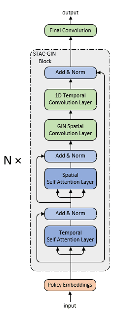
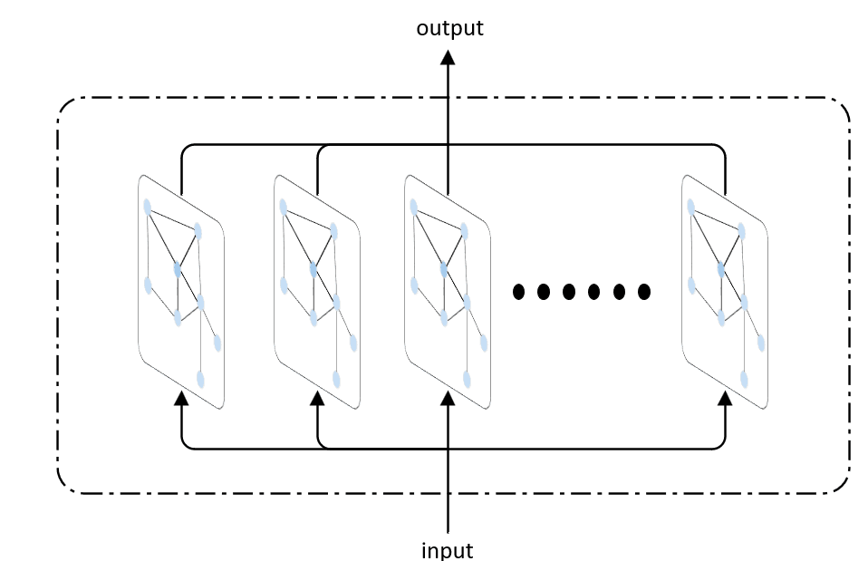

# Highway Flow Forecast
## 一、STAC-GIN
Spatial Temporal Attention and Convolution based Graph Isomorphism Network(STAC-GIN) Highway Flow Forecast

基于时空注意力与时空卷积的图同构网络高速车流量预测算法

算法架构图如下:

Spatial Convolution Layer结构如下

